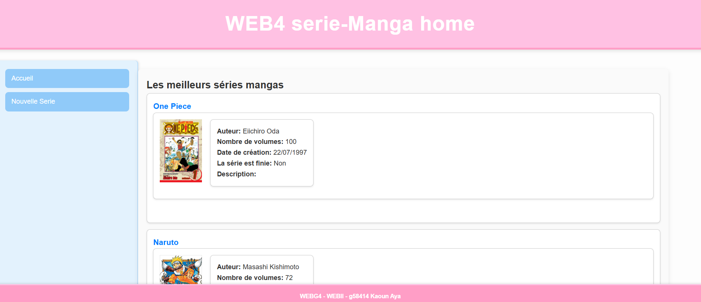
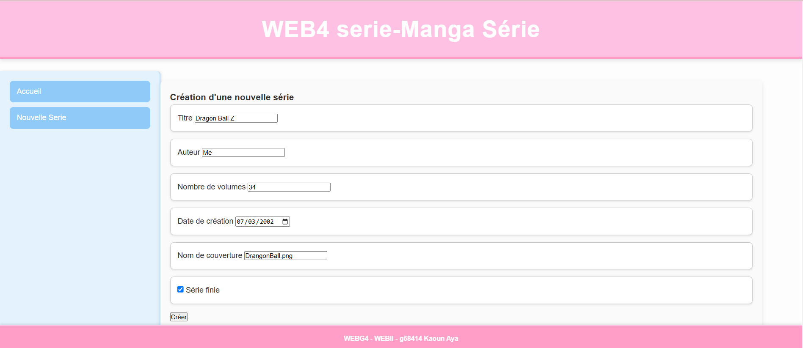

# Manga Showcase Website 📚🎌

Ce projet est un **site web simple** développé en **3 heures** comme exercice de pratique. Il utilise **Laravel** pour le backend et combine **PHP** et **JavaScript** pour une expérience utilisateur interactive. Le site est conçu pour afficher une liste de mangas et permettre l’ajout de nouveaux titres via une section dédiée.

## Fonctionnalités principales ✨

1. **Page d'accueil :**  
   - Affiche tous les mangas disponibles avec des détails comme le titre, l'auteur et une brève description.  
   - Capture d'écran disponible (`web.png`).

2. **Ajout d'un nouveau manga :**  
   - Une section spéciale permet de soumettre un nouveau manga via un formulaire interactif.  
   - Capture d'écran disponible (`web2.png`).

3. **Architecture dynamique :**  
   - Laravel est utilisé pour la gestion des routes et des vues, et JavaScript améliore les interactions utilisateur.

## Technologies utilisées 🛠️

- **Framework :** Laravel 10.x
- **Langages :** PHP, JavaScript, HTML, CSS
- **Base de données :** MySQL (via **XAMPP**)
- **Front-end :** Blade (templating engine de Laravel), CSS basique
- **Serveur local :** Apache (via **XAMPP**)
- **Autres :** Composer pour la gestion des dépendances

## Utilisation 🖥️

Pour exécuter ce projet, il faut :

1. **XAMPP :**  
   - Activer **Apache** et **MySQL** dans le panneau de contrôle XAMPP.  
   - Configurer une base de données MySQL si une version dynamique est envisagée à l'avenir.  

2. **Fichiers du projet :**  
   Placer le dossier du projet dans le répertoire `htdocs` de XAMPP.  

3. **Accès au site :**  
   Ouvrir le site via [http://localhost/nom-du-projet](http://localhost/nom-du-projet) dans un navigateur.

## Structure du projet 🗂️

- **routes/web.php** :  
  Définit les routes pour afficher les mangas et gérer l'ajout de nouveaux titres.  
- **resources/views/** :  
  Contient les vues Blade pour la liste des mangas et le formulaire d'ajout.  
- **public/js/** :  
  Fichiers JavaScript pour les interactions dynamiques du formulaire.  
- **storage/app/public/** :  
  Dossier pour les images (`web.png` et `web2.png`).

## Captures d’écran 📸

1. **Page d’accueil**  
   

2. **Formulaire d'ajout de manga**  
   

## Limites et améliorations possibles ⚙️

- **Données statiques :**  
  Les mangas actuels sont définis en dur. Une base de données pourrait être utilisée pour stocker dynamiquement les informations.  
- **Interface utilisateur :**  
  L'interface est basique et pourrait être enrichie avec des frameworks CSS comme TailwindCSS ou Bootstrap.  
- **Fonctionnalités supplémentaires :**  
  Ajouter des fonctionnalités comme la recherche, la pagination et l'affichage de détails étendus pour chaque manga.

## Auteur ✍️

- **Kaoun Aya**  
  Étudiante en développement d'applications à HE2B ESI.  
  [GitHub Profile](https://github.com/ton-profil-github)

## Licence 📜

Ce projet est réalisé uniquement à des fins d’entraînement et n’est pas destiné à un usage commercial.

---

Si tu souhaites des ajouts ou des modifications, fais-le-moi savoir ! 😊